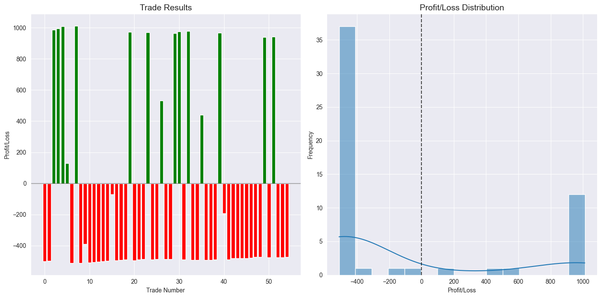

# Mean Reversion Strategy for VN30 Index Futures


## Abstract
This project develops a comprehensive backtesting and optimization method for mean reversion trading strategies applied to the VN30 Index Futures market. The system combines technical indicators (Bollinger Bands with 1.8 standard deviations, 13-period RSI, and 14-period ATR) to identify overbought and oversold conditions that signal potential price reversals. Through modular architecture, the framework enables systematic testing of the hypothesis that prices revert to their short-term moving average after reaching extremes. Validation on historical market data demonstrates the system's effectiveness in capturing mean-reverting price movements while maintaining controlled risk parameters with 4×ATR take-profit and 1×ATR stop-loss levels.

## Introduction
This project explores the application of mean reversion trading strategies to the VN30 Index Futures market (VN30F1M) as part of the Computer Finance course study. Mean reversion strategies operate on the principle that asset prices tend to revert to their historical mean or average over time. When prices deviate significantly from this mean—reaching overbought or oversold conditions—they create potential trading opportunities as the market corrects itself.

The system is built with a modular architecture that separates concerns into distinct components:
- Data loading and processing for VN30F1M futures
- Technical indicator calculation (SMA, Bollinger Bands, RSI, ATR)
- Signal generation based on band crossovers and momentum conditions
- Risk management with volatility-adjusted position sizing
- Backtesting engine with precise entry and exit execution
- Performance evaluation using standard financial metrics
- Parameter optimization to enhance strategy robustness

This separation allows for methodical strategy development and rigorous performance testing across different market conditions, enabling both academic analysis and practical trading applications.

## Trading Hypotheses


The strategy aims to capture short-term price reversals using indicators like Bollinger Bands and RSI, with ATR-based dynamic risk management. It is built on the observation that VN30F1M prices tend to revert to the mean after reaching extreme levels.

## Target Market  
- **Ticker**: VN30F1M  
- **Timeframe**: 15-minute  
- **Strategy Type**: Mean Reversion  

## Entry Conditions  

### Buy Signal (Bullish Hypothesis)  
- Price was below the lower Bollinger Band (BB20, 1.8) and has crossed back above it  
- RSI(13) is below 30 (oversold)

### Sell Signal (Bearish Hypothesis)  
- Price was above the upper Bollinger Band and has crossed back below it  
- RSI(13) is above 70 (overbought)

## Indicators Used  
- **SMA(20)**: 20-period Simple Moving Average  
- **BB20 (1.8 STD)**: Bollinger Bands with 1.8 standard deviations  
- **RSI(13)**: 13-period Relative Strength Index  
- **ATR(14)**: 14-period Average True Range for volatility-based exits

## Order Execution  
- **Entry**: Market order upon signal confirmation  
- **Position Size**: 1 contract per trade  

## Exit Conditions  

### Take-Profit  
- Exit when unrealized profit reaches +4 × ATR(14)  

### Stop-Loss  
- Exit when unrealized loss reaches -1 × ATR(14)  

---

This systematic approach aims for consistent trade execution with clear entry/exit logic, leveraging volatility-based rules to adapt to changing market conditions.


## Data
### Data Collection

The system retrieves tick-by-tick data for VN30 Index Futures from a PostgreSQL database using the `DataLoader` class. The core functionality is implemented through the `get_active_contract_data` method, which:

1. Queries active front-month contract data by joining:
   - `quote.matched` table: price and timestamp data (columns: datetime, tickersymbol, price)
   - `quote.futurecontractcode` table: contract mapping information (futurecode='VN30F1M')
   - `quote.total` table: volume data (columns: datetime, tickersymbol, quantity)

2. Executes the following SQL query:
   ```sql
   SELECT m.datetime, m.tickersymbol, m.price, v.quantity
   FROM quote.matched m
   JOIN quote.futurecontractcode f ON m.tickersymbol = f.tickersymbol 
        AND DATE(m.datetime) = f.datetime
   LEFT JOIN quote.total v ON m.tickersymbol = v.tickersymbol 
        AND m.datetime = v.datetime
   WHERE m.datetime BETWEEN %s AND %s
   AND f.futurecode = 'VN30F1M'
   ORDER BY m.datetime
   ```

3. Implements automatic data caching using the `CacheManager` class to:
   - Store retrieved data in pickle format for improved performance
   - Generate unique cache keys based on date range and contract identifier
   - Automatically load cached data when available, bypassing database queries

Database configuration setup:
```json
{
  "host": "<host or ip>",
  "port": <port>,
  "database": "<database name>",
  "user": "<username>",
  "password": "<password>"
}
```
Save as `config/database.json`
### Data Processing

The `DataProcessor` class handles the transformation of raw tick data into analytical-ready format:

1. **Contract Rollover Management**: Automatically handles VN30 futures contract rollovers at month boundaries
2. **OHLCV Generation**: Converts tick data to configurable timeframe candles (default: 15-minute)
3. **Trading Hours Filtering**: Restricts data to regular trading hours (09:00-15:00)
4. **Technical Indicator Calculation**: Adds Bollinger Bands, RSI, and ATR indicators
5. **Caching Implementation**: Implements two-level caching:
   - Tick data caching in `data_cache/contract_data/`
   - OHLCV data caching in `data_cache/ohlcv/`

## Implementation
### Environment Setup
1. Clone the repository:
```bash
git clone https://github.com/algotrade-course/Group2.git
cd group2
```

2. Create and activate virtual environment:
```bash
python -m venv venv
source venv/bin/activate  # Unix/macOS
venv\Scripts\activate     # Windows
```

3. Install dependencies:
```bash
pip install -r requirements.txt
```

4. Configure database connection:
Create `config/database.json` with your Algotrade PostgreSQL credentials

### Running the Strategy
#### Default Backtest
```bash
python src/run_backtest.py
```

#### Parameter Optimization
```bash
python src/run_optimization.py
```

#### Notebooks
For interactive analysis:
- `notebooks/updated_backtest.ipynb` - Step-by-step backtest walkthrough
- `notebooks/updated_optimization.ipynb` - Optimization process visualization

### Configuration
Strategy parameters are configured in `config/strategy_config.json`:
```json
{
    "parameters": {
        "bb_window": 20,
        "bb_std": 1.8,
        "rsi_period": 13,
        "rsi_lower": 30,
        "rsi_upper": 70,
        "atr_period": 14,
        "take_profit_mult": 4.0,
        "stop_loss_mult": 1.0,
        "commission":0.001,
        "risk_free_rate": 0.03
    }
}
```

## In-sample Backtesting
### Parameters
Using default configuration:
- Bollinger Bands: 20-period, 1.8 std dev
- RSI: 13-period, 30/70 thresholds
- ATR: 14-period
- Take-profit: 4×ATR, Stop-loss: 1×ATR

### Results
Period: 2024-01-01 to 2024-06-01

| Metric              | Value      |
|---------------------|------------|
| Win Rate            | 27.27%     |
| Profit Factor       | 0.68       |
| Sharpe Ratio        | -2.23      |
| Maximum Drawdown    | -8.35%     |
| Average Trade Return| -108.17    |
| Total Return        | -5.95%     |
| Total Trades        | 55         |
| Average Win         | 854.07     |
| Average Loss        | -469.02    |
| Expectancy          | -108.17    |


*Default parameters equity curve showing portfolio value over time*


*Detailed price chart with entry/exit signals and equity curve*

### Trade Analysis

*Profit/loss distribution of individual trades*


*Breakdown of trade exits by reason (take-profit, stop-loss, time-exit, Time-exit)*

## Optimization

### Optimization Objective Function

The optimization process uses Optuna to maximize a custom scoring function implemented in the `StrategyOptimizer.objective` method. The scoring algorithm employs a multi-factor approach:

1. **Primary Score Calculation**:
   ```python
   score = sharpe_ratio - |0.1 * max_drawdown| + (total_trades / 1000)
   ```
   
   This combines:
   - Sharpe ratio as the primary performance metric
   - Penalty for maximum drawdown (coefficient: 0.1)
   - Bonus for trade count to avoid overly passive strategies

2. **Conditional Scoring Logic**:
   - If total trades < 10: Score = -1.0 (invalid strategy)
   - If Sharpe ratio ≤ 0: Score = total_return × 10 (fallback to return-based scoring)
   - Otherwise: Uses the multi-factor formula above

3. **Error Handling**: Returns -1.0 for any failed trials to ensure robust optimization

This scoring function balances risk-adjusted returns (Sharpe ratio), risk control (drawdown penalty), and strategy activity level, ensuring the optimization process identifies robust trading parameters.

### Process
Using Optuna for optimization
- Number of trials: 100
- Objective: Maximize Sharpe ratio
- Timeframes tested: 5min, 15min, 30min, 1h, 4h, 1d
- Parameter ranges:
  - BB window: 10-50
  - BB std: 1.0-3.0
  - RSI period: 5-30
  - ATR period: 5-30
  - Take-profit multiplier: 2.0-6.0
  - Stop-loss multiplier: 0.5-2.0

### Results
Best parameters found:
```json
{
    "timeframe": "5min",
    "bb_window": 23,
    "bb_std": 1.1,
    "rsi_period": 11,
    "rsi_lower": 37,
    "rsi_upper": 64,
    "atr_period": 19,
    "take_profit_mult": 5.6,
    "stop_loss_mult": 1.2
}
```

### Optimization Analysis


*Optimization score progression over 100 trials (Best score: ~1.5)*


*Parameter impact on optimization score (correlation coefficients)*

Parameter importance interpretation:
- `take_profit_mult` (+0.44): Strong positive correlation
- `timeframe_num` (+0.42): Strong positive correlation
- `bb_std` (-0.50): Strong negative correlation
- `bb_window` (-0.37): Moderate negative correlation
- `rsi_upper` (-0.33): Moderate negative correlation
- `stop_loss_mult` (-0.17): Slight negative correlation
- `rsi_lower` (+0.26): Mild positive correlation
- `atr_period` (+0.10): Minimal positive impact 
- `rsi_period` (-0.03): Negligible negative impact

Stronger coefficients (closer to ±1) indicate more influential parameters.


*Performance comparison across different timeframes*
Max Score by Timeframe: The 5-minute timeframe shows the best performance with a max score around 1.5, closely followed by the 15-minute. In contrast, the 4-hour timeframe performs the worst, with a max score below -1.0. This highlights the strength of shorter timeframes for this strategy.

Average Sharpe Ratio by Timeframe: Sharpe ratios are negative across all timeframes. The 4-hour timeframe has the most extreme value at approximately -135, while the 1-hour and 5-minute timeframes are relatively less negative, hovering closer to 0.

Average Win Rate by Timeframe: The 4-hour timeframe has the highest average win rate, exceeding 80%, with the 30-minute timeframe coming next at around 49%. Despite the high win rate, the 4-hour timeframe's poor returns suggest other performance issues.

Average Number of Trades: A clear inverse relationship exists between timeframe and trade frequency. The 5-minute timeframe averages nearly 100 trades, providing more opportunities, while the 4-hour timeframe averages just 1–2 trades, indicating limited activity.

Performance Paradox: Although the 4-hour timeframe boasts the highest win rate, it also has the worst overall performance. This suggests a scenario where fewer but larger losses outweigh frequent small wins, or where low trade frequency hinders long-term profitability.

## Out-of-sample Backtesting
### Parameters
Using optimized parameters from previous step

### Results
Period: 2024-06-01 to 2025-01-01

| Metric              | Value     |
|---------------------|----------|
| Total Return        | 15.26%   |
| Sharpe Ratio        | -1.32    |
| Maximum Drawdown    | -6.90%   |
| Win Rate            | 39.21%   |
| Profit Factor       | 1.20     |
| Total Trades        | 227      |
| Average Trade Return| 67.24    |
| Average Win         | 1029.24  |
| Average Loss        | -553.19  |
| Expectancy          | 67.24    |


*Optimized parameters performance on validation data*


### Comparison with Default Parameters
| Metric            | Default     | Optimized   | Improvement | Improvement %   |
|-------------------|-------------|-------------|-------------|-----------------|
| Win Rate          | 36.84%      | 39.21%      | +2.37%      | +6.42%          |
| Profit Factor     | 1.03        | 1.20        | +0.17       | +16.40%         |
| Sharpe Ratio      | -1.74       | -1.32       | +0.41       | +23.84%         |
| Max Drawdown      | -5.33%      | -6.90%      | -1.57%      | -29.37%         |
| Total Return      | 0.68%       | 15.26%      | +14.59%     | +2159.68%       |
| Total Trades      | 76          | 227         | +151        | +198.68%        |


*Performance metrics: Default vs. Optimized parameters*


*Portfolio value comparison between default and optimized parameters*


## Conclusion

Since the initial hypothesis, the team has successfully developed and implemented a comprehensive trading system that incorporates backtesting, optimization, and visualization components. The strategy, based on mean reversion principles using Bollinger Bands, RSI, and ATR, has been effectively applied to the VN30 Index Futures market, yielding results that align with the original hypothesis of price reverting to the mean after significant deviations.

The optimization process has proven valuable, enhancing performance by fine-tuning parameters. However, it is clear that optimization doesn't always lead to the best set of parameters. At times, it can generate false signals, particularly when market conditions change or when applied to different timeframes. The results show that timeframes play a crucial role in the strategy's performance, with shorter timeframes providing more frequent signals but also more noise, while longer timeframes offer fewer trades but higher win rates.

While the system has been implemented successfully, it can still be considered somewhat naive in its approach. There is room for improvement, particularly in refining the optimization process to avoid overfitting and reducing the risk of false signals. Additionally, further work is needed to make the strategy more adaptive to varying market conditions.

In conclusion, while the strategy is viable and demonstrates potential, future improvements could focus on refining the optimization process, incorporating market condition filters, and exploring different timeframes for better performance consistency.


---
